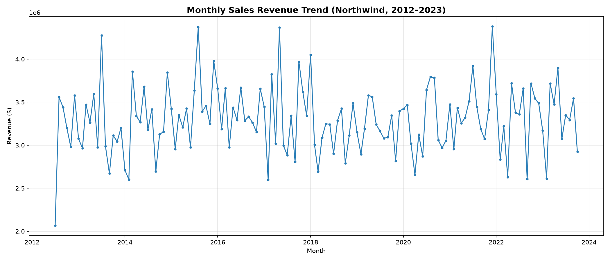
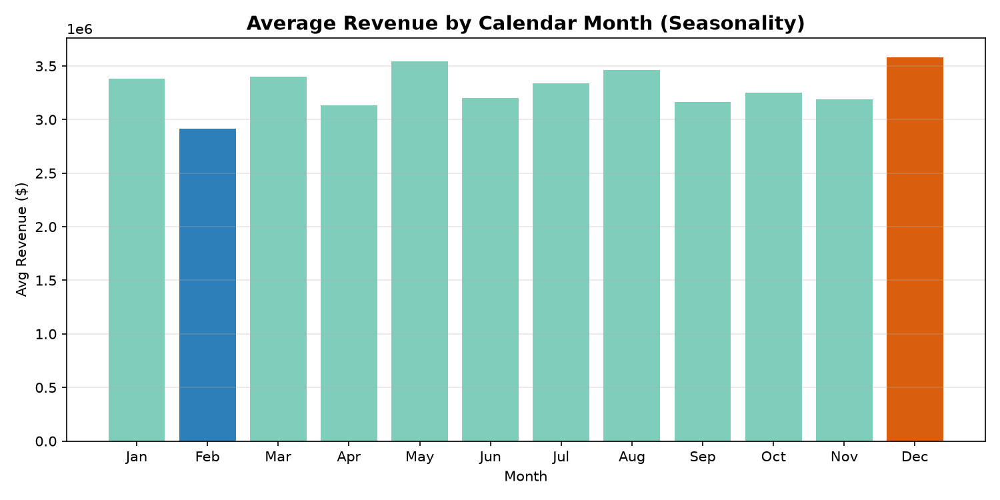

# Northwind Sales Analysis — SQL + Python

A data analysis project exploring sales performance, seasonality, and customer/employee patterns using the Northwind database, queried with SQL and analyzed/visualized with Python (pandas, matplotlib).

## Objective

Simulate a real analyst task: given a sales database, answer concrete business questions — who are the key customers, how does revenue move over time, which product categories and employees perform well — and turn raw query output into findings a business stakeholder could act on.

## Dataset

This project uses the [Northwind SQLite port by jpwhite3](https://github.com/jpwhite3/northwind-SQLite3), which extends the classic Northwind schema (customers, orders, order details, products, employees, categories, shippers) with an expanded dataset: **16,282 orders** and **609,283 order-detail line items** spanning **July 2012 – October 2023**. This is larger than the textbook Northwind dataset (~830 orders), which affects the raw dollar figures below but not the analytical approach.

## Tech Stack

- **SQLite** — database engine
- **SQL** — all analysis queries (joins, aggregations, CTEs)
- **Python** — pandas, sqlite3, matplotlib
- **Jupyter Notebook** — analysis environment
- **DB Browser for SQLite** — schema exploration

## Key Findings

### 1. Top Customers by Revenue
The top 10 customers by revenue are led by B's Beverages ($6.15M) and Hungry Coyote Import Store ($5.70M), with the remaining top 10 clustered fairly tightly between $5.4M–$5.6M. No single customer dominates disproportionately — revenue concentration among top accounts is moderate, not extreme.

### 2. Monthly Sales Trend & Seasonality
Revenue holds steady around $3–3.5M/month across the full 11-year span, with no long-term growth or decline trend — this is a mature, stable business rather than one scaling or shrinking. There is a real, moderate seasonal pattern: **December is the strongest month** ($3.58M avg), consistent with holiday-season purchasing, while **February is the weakest** ($2.92M avg, ~12% below average), consistent with a post-holiday pullback. The swing between the best and worst month is about 23% — present, but not dramatic.

### 3. Category Performance
Raw revenue ranking is misleading here since categories have different product counts. On a **revenue-per-product** basis, **Meat/Poultry stands out** as the most efficient category ($10.8M/product) — nearly double the next-best category (Beverages, $7.68M/product) despite having only 6 products. **Grains/Cereals and Seafood** show the weakest per-product revenue efficiency, worth investigating for pricing, demand, or stocking issues.

### 4. Customer Order Frequency
An initial one-time-vs-repeat-buyer split found **100% of customers are repeat buyers** — not a meaningful finding on its own, since it reflects a small (93 customers), long-running (11-year) customer base rather than genuine loyalty behavior. A frequency-tier breakdown shows order volume is **remarkably homogeneous** across customers (173–204 average orders/customer), with no distinct low-engagement segment. This suggests the dataset represents an already-retained customer base, not a mix of new, active, and churned customers.

### 5. Employee Performance
All 9 employees show tightly clustered performance — total revenue ranges $48.3M–$51.5M (a spread of only ~6%), and average revenue per order sits around $27,000 for everyone regardless of title (Sales Representative, Sales Manager, VP of Sales, Inside Sales Coordinator). No employee stands out as an over- or under-performer, suggesting either well-distributed lead/order assignment or that this dataset's order structure doesn't meaningfully differentiate rep-level skill.

## Visualizations


*Monthly revenue, July 2012 – October 2023. Stable overall with a recurring seasonal spike-and-dip pattern.*


*Average revenue by calendar month, aggregated across all years. December peaks, February troughs.*

## Repo Structure

```
sql-python-sales-analysis/
├── README.md
├── data/               # northwind.db (SQLite database)
├── sql/                # analysis queries, one file per question
├── notebooks/          # Jupyter notebook with Python analysis + charts
├── images/             # exported charts embedded above
└── requirements.txt
```

## How to Run

```bash
git clone https://github.com/JDMalkerion/sql-python-sales-analysis.git
cd sql-python-sales-analysis
python3 -m venv venv
source venv/bin/activate
pip install -r requirements.txt
jupyter notebook notebooks/sales_analysis.ipynb
```


